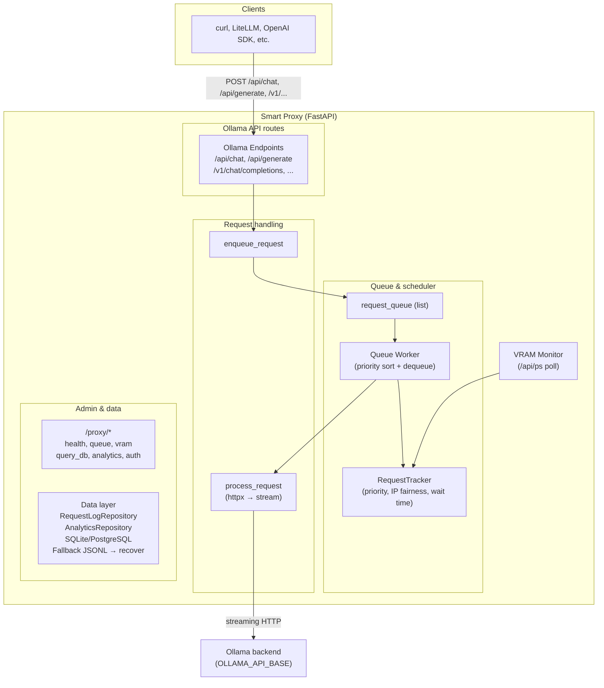

# Ollama Smart Proxy — Architecture

**Version:** 4.0  
**Last updated:** 2026-02-11  
**Status:** Current (post–v4.0 simplification; pure HTTP proxy, no LiteLLM)

This document describes the **current** architecture of the Ollama Smart Proxy as implemented in the codebase.

---

## 1. Overview

The Smart Proxy is a **pure HTTP proxy** with an intelligent request queue. It sits between clients and an Ollama backend and:

- **Queues** chat/generate requests and forwards them to Ollama in an order that minimizes VRAM churn.
- **Forwards** requests and responses **unchanged** (no format conversion).
- **Logs** request metadata to a database (SQLite or PostgreSQL) with optional file fallback.
- **Exposes** admin and analytics endpoints under `/proxy/*`.

**Design principle:** “We’re a proxy with smart queueing, not a format converter.” Value is in scheduling and observability, not in translating APIs.

---

## 2. High-Level Architecture

---

## 3. Core Components

### 3.1 Application Entry and Routers

| Component | Location | Role |
|-----------|----------|------|
| **FastAPI app** | `src/smart_proxy.py` | Creates app, lifespan (start VRAM monitor, queue worker, fallback recovery), injects dependencies, mounts routers. |
| **Ollama router** | `src/ollama_endpoints.py` | Prefix: none. Handles `/api/chat`, `/api/generate`, `/v1/chat/completions`, `/v1/completions` → enqueue; admin routes (`/api/pull`, `/api/push`, etc.) → verify admin + forward; catch-all → forward. |
| **Proxy router** | `src/proxy_endpoints.py` | Prefix: `/proxy`. Health, queue status, VRAM status, query_db, query_db filters (incl. session_id), request detail `GET /proxy/requests/{request_id}`, WebSocket `/proxy/live` for live stream, dashboard `GET /proxy/dashboard` (and static assets), analytics, testing control, auth. |

Dependencies (tracker, queue, VRAM monitor, admin settings, etc.) are injected from `smart_proxy.py` into the router modules via `inject_dependencies` / `set_dependencies`.

### 3.2 Request Queue and Worker

- **Queue:** In-memory **list** of `QueuedRequest` (`request_queue: List[QueuedRequest]`), protected by `queue_lock`.
- **Priority:** Not stored on the item. On each run, the **queue worker** computes a priority score for every queued request, **sorts** by score (ascending), and **dequeues** the lowest-scoring (highest-priority) item. So the queue is “priority-ordered by dynamic scoring,” not a heap.
- **Concurrency:** Worker only dequeues when `tracker.active_request_count < OLLAMA_MAX_PARALLEL` (default 3).
- **QueuedRequest** (dataclass): `request_id`, `timestamp`, `ip`, `model_name`, `body`, `raw_body`, `raw_request`, `path`, `future`, `session_id` (optional, for live dashboard metadata). The raw request and body are kept so the proxy can forward the exact bytes to Ollama.

### 3.3 RequestTracker and Priority Scoring

**RequestTracker** (in `smart_proxy.py`) holds:

- `ip_queued`: per-IP count of requests currently in the queue.
- `ip_history`: per-IP list of recent request timestamps (for rate/window checks).
- `active_request_count`: number of requests currently being processed.
- `recently_started_models`: model (or set) recently started, used for affinity until the next VRAM poll.

**Priority score** (lower = higher priority):

1. **VRAM / model state (base score):**
   - Model already loaded (or recently started): `PRIORITY_BASE_LOADED` (e.g. 100).
   - Can fit in parallel: `PRIORITY_BASE_PARALLEL` (e.g. 200).
   - Small swap: `PRIORITY_BASE_SMALL_SWAP` (e.g. 400).
   - Large swap (model &gt; threshold GB): `PRIORITY_BASE_LARGE_SWAP` (e.g. 800).
2. **IP fairness:** Penalty from queued + recent requests in `RATE_LIMIT_WINDOW`, capped (e.g. +5 per item, max +100).
3. **Wait time:** Bonus `PRIORITY_WAIT_TIME_MULTIPLIER * wait_seconds` (e.g. -1 per second).

All base and multiplier values are configurable via environment variables (see Configuration).

### 3.4 VRAM Monitor

- **Class:** `VRAMMonitor` in `src/vram_monitor.py`.
- **Source of truth:** Ollama HTTP API `GET /api/ps` (not the `ollama ps` CLI).
- **Behavior:** Background task polls every `VRAM_POLL_INTERVAL` seconds. Parses response into `ModelInfo` (name, size_vram, etc.) and updates:
  - `currently_loaded`: dict of model name → `ModelInfo`.
  - `vram_history`: per-model list of last 10 observed VRAM sizes (for models not currently loaded).
- **API used by scheduler:**
  - `get_vram_for_model(model_name)` → bytes or None (current, history, or fuzzy match by base name).
  - `can_fit_parallel(model_name, total_vram_bytes)` → whether adding this model would exceed total VRAM.
- **On-demand poll:** When a request starts for a model that was not loaded, a one-off delayed poll is triggered after 1s to refresh state sooner.

### 3.5 Request Processing (Forwarding and Stream Tap)

- **process_request(QueuedRequest, priority_score):** Builds target URL from `OLLAMA_API_BASE` and `request.path`, preserves query string; copies headers (drops `host`, `content-length`); sends **raw body bytes** with `httpx.AsyncClient(timeout=REQUEST_TIMEOUT)`, `stream=True`.
- **Stream tap** (`src/stream_tap.py`): The response body is not streamed raw to the client directly. Instead, `tee_stream()` iterates over the upstream bytes, yields each chunk unchanged to the client (so behaviour is unchanged), and in parallel parses NDJSON lines to extract response text (per endpoint: `/api/chat` → `message.content`, `/api/generate` → `response`, `/v1/chat/completions` → `choices[0].delta.content`, etc.). Accumulated text is passed to an `on_done` callback when the stream ends; that callback calls `RequestLogRepository.log_request(..., response_text=accumulated)`. An `on_chunk` callback is used to push each text delta to the **live broadcaster** for real-time admin monitoring.
- **Live broadcaster** (`src/live_broadcaster.py`): In-memory store of in-flight request content. When a request starts streaming, `request_started(request_id, metadata)` is called; for each parsed text delta, `chunk(request_id, delta)` appends and broadcasts to all connected WebSocket clients; when the stream ends, `request_completed(request_id, status)` is called. Admin clients connect to `GET /proxy/live` (WebSocket, auth via query `key=` or IP/session). New subscribers receive the current set of active request_ids and their accumulated text so they can “join” in-progress streams.
- Logging: “processing” at start; on stream end, “completed” or “error” with full `response_text` (and duration, etc.) via `log_request`.

### 3.6 Database and Data Access

- **DatabaseConnection** (`src/database.py`): Supports **SQLite** or **PostgreSQL** via `DB_TYPE`. Creates tables from SQLAlchemy models; exposes `get_session()`, `write_to_fallback_file()`, `recover_from_fallback_files()`.
- **RequestLog** (SQLAlchemy): `request_logs` table — `request_id`, `source_ip`, `model_name`, `prompt_text`, `response_text`, `timestamp_received`, `timestamp_started`, `timestamp_completed`, `duration_seconds`, `priority_score`, `queue_wait_seconds`, `processing_time_seconds`, `status`, `error_message`, `session_id`, `outgoing_conversation_fingerprint`, `created_at`. **Session grouping is content-based**: a request belongs to the same session as a previous one when its `messages` array (minus the last user message) matches that previous request’s messages plus assistant response. At enqueue, an incoming fingerprint is computed from `messages[:-1]` and matched to `outgoing_conversation_fingerprint` (hash of messages+response) of a prior request from the same IP; if found, that request’s `session_id` is reused. If the request starts with a single user message (no history), it gets a new session.
- **RequestLogRepository** (`src/data_access.py`): `log_request()` (upsert-style create/update), plus get-by-id, by-model, by-IP. On DB failure, writes to fallback JSONL under `FALLBACK_LOG_DIR`.
- **AnalyticsQueryBuilder** (`database.py`): Raw analytics queries (error rates, counts by model/IP, priority distribution, performance stats, requests over time, model bunching). DB-agnostic via parameterized SQL and DB-specific date truncation.
- **AnalyticsRepository** (`data_access.py`): Wraps `AnalyticsQueryBuilder` for the `/proxy/analytics` API.

### 3.7 Logging

- **log_formatter.py:** `StructuredFormatter` (JSON or human-readable via `LOG_FORMAT`), `UvicornAccessFormatter` for access logs. JSON mode is suitable for Grafana/Loki. `setup_logging()` configures root and uvicorn/httpx loggers.

### 3.8 Utilities and Security

- **utils.py:** `generate_request_id()`, `verify_admin_access(request, admin_key, static_ips, authorized_ips)` (static IPs, time-limited authorized IPs from `/proxy/auth`, or `X-Admin-Key` header), `forward_request_to_ollama()` for non-queued admin/catch-all forwarding.

---

## 4. Request Flow (Queued Endpoints)

1. Client sends POST to e.g. `/api/chat` or `/v1/chat/completions`.
2. **ollama_endpoints** calls `enqueue_request(request, path)`.
3. **enqueue_request:** Read body, validate `model`, get client IP, generate `request_id`, call `tracker.mark_request_queued(ip)`, create `QueuedRequest` with `raw_body` and `raw_request`, compute initial priority, log “queued” to DB (or fallback), append to `request_queue`, then **await** `future` (up to `REQUEST_TIMEOUT`).
4. **queue_worker** (loop): If not paused and `active_request_count < OLLAMA_MAX_PARALLEL`, take `queue_lock`, compute priorities for all queued items, sort, pop lowest-score item, move to `active_requests`, call `tracker.add_request(ip, model)`, spawn `process_request(req, priority_score)`.
5. **process_request:** Log “processing”, build URL and headers, send request with `raw_body` to Ollama via httpx (streaming). Stream response back; set `future.set_result(response)`. On completion/error, log status and duration, update stats, then `tracker.remove_request()`, remove from `active_requests`.

---

## 5. Configuration (Environment Variables)

| Area | Variables |
|------|-----------|
| **Ollama** | `OLLAMA_API_BASE` or `OLLAMA_HOST`, `OLLAMA_MAX_PARALLEL` |
| **Proxy** | `PROXY_HOST`, `PROXY_PORT`, `REQUEST_TIMEOUT` |
| **VRAM** | `TOTAL_VRAM_MB`, `VRAM_POLL_INTERVAL` |
| **Priority** | `PRIORITY_BASE_LOADED`, `PRIORITY_BASE_PARALLEL`, `PRIORITY_BASE_SMALL_SWAP`, `PRIORITY_BASE_LARGE_SWAP`, `PRIORITY_BASE_LARGE_SWAP_THRESHOLD_GB`, `PRIORITY_WAIT_TIME_MULTIPLIER`, `PRIORITY_RATE_LIMIT_MULTIPLIER`, `RATE_LIMIT_WINDOW` |
| **Logging** | `LOG_FORMAT` (json/human), `LOG_LEVEL`, `ACCESS_LOG_LEVEL` |
| **Database** | `DB_TYPE` (sqlite/postgres), `DB_HOST`, `DB_PORT`, `DB_NAME`, `DB_USER`, `DB_PASSWORD`, `SQLITE_DB_PATH`, `FALLBACK_LOG_DIR`, `FALLBACK_LOG_MAX_SIZE` |
| **Admin** | `PROXY_ADMIN_KEY`, `ADMIN_IPS` (comma-separated) |

See `.env.example` for defaults and examples.

---

## 6. Security (Admin Endpoints)

- **Protected paths:** `/api/pull`, `/api/push`, `/api/create`, `/api/copy`, `/api/delete`, `/api/blobs` (and catch-all if path matches); `/proxy/query_db`, `/proxy/analytics`, `/proxy/requests/*`, `/proxy/dashboard`, `/proxy/dashboard/*`, and WebSocket `/proxy/live` (auth via query param `key=` or IP/session).
- **Auth:** Static IPs from `ADMIN_IPS`, or IPs that have called `POST /proxy/auth` with correct `key` (24h TTL), or request header `X-Admin-Key` matching `PROXY_ADMIN_KEY`. WebSocket accepts same IP/session or `?key=PROXY_ADMIN_KEY`. Enforced by `verify_admin_access()` (and equivalent checks for WebSocket).

---

## 7. Key Design Decisions

1. **Pure HTTP proxy (v4.0):** No LiteLLM; no request/response transformation. Preserves compatibility with all clients (including tool-calling) and simplifies maintenance.
2. **Dynamic priority:** Score is recomputed at dequeue time so wait time and current VRAM state are up to date.
3. **List + sort vs heap:** Queue is a list; worker sorts by current score each time. Simple and correct for moderate queue sizes.
4. **VRAM via /api/ps:** Uses Ollama’s HTTP API only; no shell or cache file dependency. History and fuzzy matching improve estimates for unknown or alternate tags.
5. **Database abstraction:** SQLite for dev, PostgreSQL for prod; same schema and repositories. Fallback JSONL + recovery on startup ensure logs are not lost when DB is unavailable.
6. **Dependency injection:** Routers receive shared state (tracker, queue, locks, config) via explicit inject/set functions to keep them testable and avoid circular imports.

---

## 8. Module Map

| Module | Responsibility |
|--------|----------------|
| `smart_proxy.py` | App, lifespan, queue worker, enqueue/process_request (with session_id), RequestTracker, QueuedRequest, global state; wires stream_tap and live_broadcaster. |
| `ollama_endpoints.py` | Queued Ollama endpoints, protected admin routes, catch-all forward. |
| `proxy_endpoints.py` | /proxy health, queue, vram, query_db (incl. session_id filter), request detail, WebSocket /proxy/live, dashboard static, analytics, testing, auth. |
| `stream_tap.py` | tee_stream, NDJSON parsing per endpoint, on_chunk/on_done callbacks for logging and broadcast. |
| `live_broadcaster.py` | LiveBroadcaster: in-flight request state, broadcast to WebSocket clients, join in-progress. |
| `vram_monitor.py` | VRAMMonitor, /api/ps polling, get_vram_for_model, can_fit_parallel. |
| `database.py` | DatabaseConnection, RequestLog (incl. session_id), AnalyticsQueryBuilder, init_db, get_db, fallback and recovery. |
| `data_access.py` | RequestLogRepository, AnalyticsRepository, init_repositories, get_*_repo. |
| `utils.py` | generate_request_id, verify_admin_access, forward_request_to_ollama. |
| `log_formatter.py` | StructuredFormatter, UvicornAccessFormatter, setup_logging. |

---

## 9. Related Documentation

- **Changelog:** `docs/changelog/v4.1_MONITORING_WEBUI.md` (monitoring dashboard, stream tap, live WebSocket), `docs/changelog/v4.0_SIMPLIFICATION.md` (pure HTTP proxy), plus earlier version docs.
- **Deployment:** `docs/DEPLOYMENT.md`, `README.md`, `run_proxy.sh`, `.env.example`.
- **Logging:** `docs/LOGGING.md`.
- **Roadmap:** `docs/TODO.md`. Monitoring Web UI (4.1): dashboard at `/proxy/dashboard`, live stream via WebSocket `/proxy/live`, history and conversation views, request detail and raw JSON.
